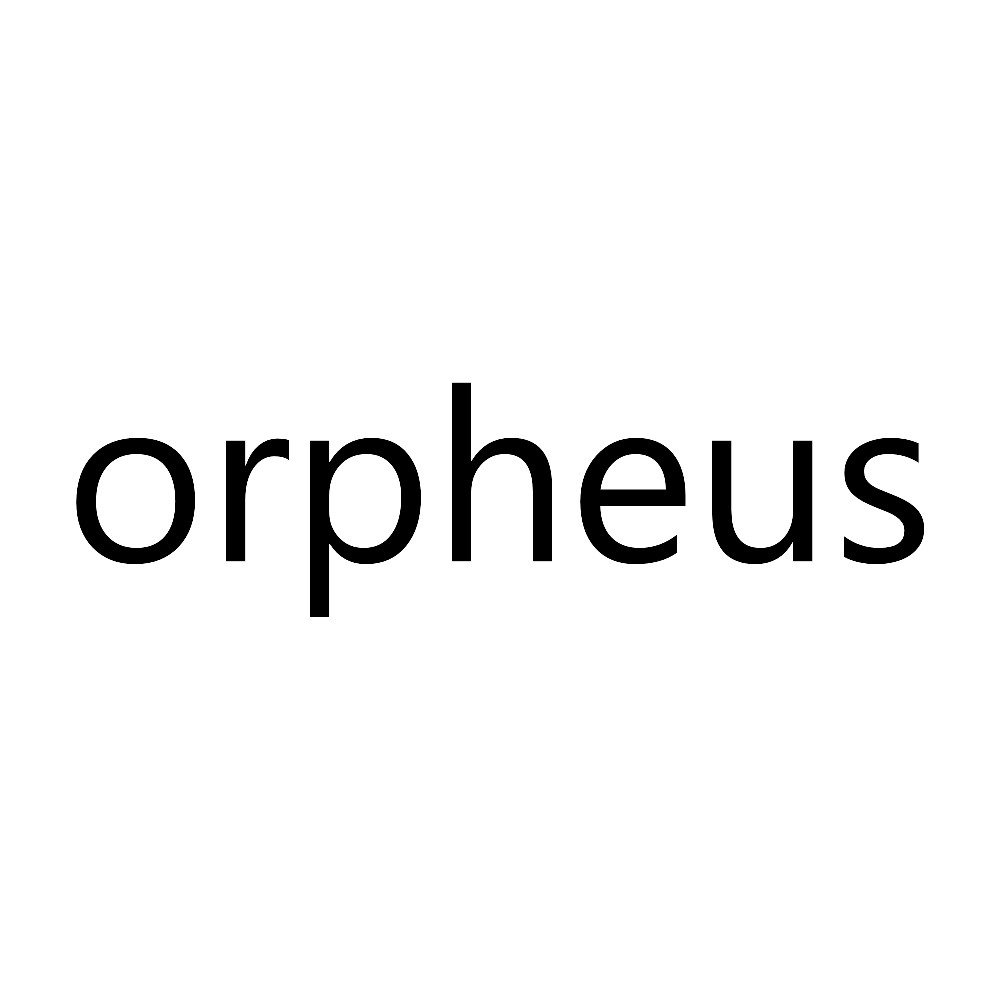

<p align="center">
  
</p>

<p align="center">
  DMA-based memory analysis framework with MCP support for AI-assisted reverse engineering.
</p>

## Features

- **DMA Memory Access** - Read/write process memory via FPGA DMA hardware
- **Pattern & String Scanning** - Fast signature scanning with wildcard support
- **x86-64 Disassembler** - Zydis-powered instruction decoding
- **RTTI Analysis** - Parse MSVC runtime type information, discover classes
- **CPU Emulation** - Unicorn-based code emulation for decryption stubs
- **MCP Server** - REST API for Claude/LLM integration
- **CS2 Schema Dumper** - Counter-Strike 2 class/offset extraction

## Requirements

- Windows 10/11 (64-bit)
- Visual Studio 2022 with C++20 support
- CMake 3.20+
- DMA hardware (PCILeech-compatible FPGA)

## Building

```bash
mkdir build && cd build
cmake ..
cmake --build . --config Release
```

Output: `build/bin/Release/orpheus.exe`

## Usage

```bash
# Launch GUI
orpheus.exe

# Auto-connect to DMA device
orpheus.exe --connect
```

### MCP Integration

1. Start Orpheus and enable MCP server in settings
2. Configure Claude Code to use the MCP bridge:

```json
{
  "mcpServers": {
    "orpheus": {
      "command": "node",
      "args": ["path/to/mcp_bridge.js"],
      "env": {
        "ORPHEUS_MCP_URL": "http://localhost:8765",
        "ORPHEUS_API_KEY": "your-api-key"
      }
    }
  }
}
```

## Project Structure

```
orpheus/
├── src/
│   ├── core/          # DMA interface, runtime management
│   ├── analysis/      # Disassembler, pattern scanner, RTTI parser
│   ├── emulation/     # Unicorn CPU emulator
│   ├── dumper/        # Game-specific SDK dumpers
│   ├── mcp/           # MCP server implementation
│   ├── ui/            # ImGui application
│   └── utils/         # Logging, bookmarks
├── cmake/             # CMake modules (dependencies, resource embedding)
├── resources/
│   ├── dlls/          # VMM/LeechCore DLLs
│   └── fonts/         # JetBrains Mono
└── mcp_bridge.js      # MCP stdio-to-HTTP adapter
```

## Dependencies

Fetched automatically via CMake FetchContent:
- GLFW 3.3.9
- Dear ImGui 1.90.1 (docking branch)
- spdlog 1.13.0
- Zydis 4.0.0
- Unicorn Engine 2.1.4
- cpp-httplib 0.15.3
- nlohmann/json 3.11.3

## License

Copyright (C) 2025 super2xl

This program is free software: you can redistribute it and/or modify it under the terms of the GNU General Public License as published by the Free Software Foundation, either version 3 of the License, or (at your option) any later version.

See [LICENSE](LICENSE) for details.
