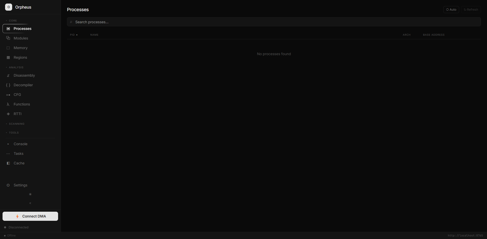
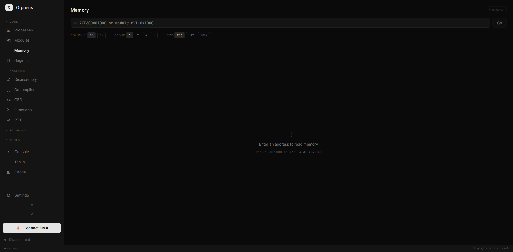
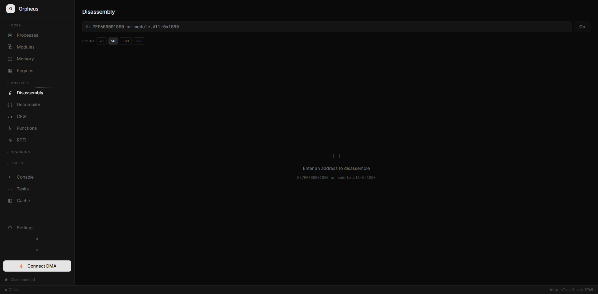

<p align="center">
  
</p>

<p align="center">
  DMA-based memory analysis framework with MCP support for AI-assisted reverse engineering.
</p>

<p align="center">
  <a href="https://github.com/super2xl/orpheus/actions/workflows/release.yml"></a>
  <a href="https://github.com/super2xl/orpheus/releases"></a>
  <a href="https://github.com/super2xl/orpheus/releases"></a>
  <a href="LICENSE"></a>
</p>

## Features

### Core Analysis
- **DMA Memory Access** - Read/write process memory via FPGA DMA hardware
- **Pattern & String Scanning** - Fast signature scanning with wildcard support, async with progress
- **x86-64 Disassembler** - Capstone-powered instruction decoding with control flow analysis
- **Ghidra Decompiler** - Full C pseudocode generation with CS2 schema type injection
- **Function Recovery** - Automatic discovery via prologue, call targets, pdata, and RTTI
- **CFG Analysis** - Control flow graphs with loop detection and visualization layout
- **RTTI Analysis** - Parse MSVC runtime type information, discover class hierarchies
- **CPU Emulation** - Unicorn-based code emulation for decryption stubs

### CS2 Integration
- **Schema Dumper** - Extract all classes, fields, and offsets from Source 2
- **Entity System** - Live player enumeration, local player, entity inspection
- **Radar Panel** - Real-time minimap with player positions
- **Dashboard** - Match state, player health bars, team info

### AI Integration
- **MCP Server** - 40+ REST API endpoints for Claude/LLM integration
- **Expression Evaluator** - Parse `client.dll+0x1234`, `[[base]+0x10]+0x20`
- **Bookmarks** - Persistent, categorized address annotations

## Screenshots

<p align="center">
  
  
</p>
<p align="center">
  <em>Process list with live refresh &nbsp;•&nbsp; Module browser with base addresses</em>
</p>

<p align="center">
  
  
</p>
<p align="center">
  <em>Hex editor with ASCII view &nbsp;•&nbsp; x86-64 disassembly</em>
</p>

<p align="center">
  
  
</p>
<p align="center">
  <em>MCP server configuration &nbsp;•&nbsp; MCPinstaller auto-detects clients</em>
</p>

<p align="center">
  
</p>
<p align="center">
  <em>Status bar with detected FPGA device</em>
</p>

## Requirements

### Windows
- Windows 10/11 (64-bit)
- Visual Studio 2022 with C++20 support
- CMake 3.20+
- DMA hardware (PCILeech-compatible FPGA)

### Linux
- Ubuntu 22.04+ / Debian 12+ (or equivalent)
- GCC 12+ or Clang 15+
- CMake 3.20+
- OpenGL 3.3+ capable GPU
- USB permissions for DMA device (see below)

## Building

### Windows

```bash
mkdir build && cd build
cmake ..
cmake --build . --config Release
```

### Linux

```bash
# Install dependencies (Ubuntu/Debian)
sudo apt install build-essential cmake libglfw3-dev libgl1-mesa-dev

# Build
mkdir build && cd build
cmake ..
cmake --build . -j$(nproc)

# USB permissions for DMA device
sudo cp ../resources/99-fpga.rules /etc/udev/rules.d/
sudo udevadm control --reload-rules
sudo udevadm trigger
```

### Output
- `build/bin/Release/orpheus` - Main application
- `build/bin/Release/MCPinstaller` - MCP client configuration tool

## Usage

```bash
# Launch GUI
./orpheus

# Auto-connect to DMA device
./orpheus --connect
```

### MCP Integration

#### Quick Setup (Recommended)

Use **MCPinstaller** to automatically configure all your MCP clients:

1. Start Orpheus and enable MCP server in settings
2. Copy the API key from Orpheus (Settings > MCP > Copy API Key)
3. Run `MCPinstaller` (included in releases)
4. Enter your Orpheus server URL and API key
5. Select which clients to configure (Claude Desktop, Cursor, VS Code, etc.)
6. Click Install - restart your MCP clients to apply

MCPinstaller auto-detects and configures: Claude Desktop, Cursor, Claude Code, Windsurf, VS Code, Cline, Roo Code, LM Studio, Zed, Amazon Q, Warp, and more.

#### Manual Configuration

Alternatively, manually add to your MCP client config (e.g., `~/.claude/claude_desktop_config.json`):

```json
{
  "mcpServers": {
    "orpheus": {
      "command": "node",
      "args": ["C:/path/to/mcp_bridge.js"],
      "env": {
        "ORPHEUS_MCP_URL": "http://192.168.1.100:8765",
        "ORPHEUS_API_KEY": "oph_your_key_here"
      }
    }
  }
}
```

**Notes:**
- `ORPHEUS_MCP_URL`: Use `localhost` if on the same machine, otherwise use the Orpheus server IP
- `ORPHEUS_API_KEY`: Required - copy from Orpheus GUI

### MCP Tools

Orpheus exposes 40+ tools through the MCP API:

| Category | Tools |
|----------|-------|
| Memory | `read_memory`, `write_memory`, `scan_pattern`, `scan_strings`, `resolve_pointer` |
| Analysis | `disassemble`, `decompile`, `find_xrefs`, `memory_regions` |
| Functions | `recover_functions`, `get_function_at`, `get_function_containing`, `build_cfg` |
| RTTI | `rtti_parse_vtable`, `rtti_scan`, `rtti_scan_module`, `rtti_cache_*` |
| Emulation | `emu_create`, `emu_run`, `emu_set_registers`, `emu_map_module` |
| CS2 | `cs2_init`, `cs2_inspect`, `cs2_list_players`, `cs2_get_game_state` |
| Utilities | `evaluate_expression`, `bookmark_*`, `task_*` |

## Project Structure

```
orpheus/
├── src/
│   ├── core/          # DMA interface, runtime management
│   ├── analysis/      # Disassembler, pattern scanner, RTTI, function recovery
│   ├── decompiler/    # Ghidra integration, type injection
│   ├── emulation/     # Unicorn CPU emulator
│   ├── dumper/        # CS2 schema dumper
│   ├── mcp/           # MCP server (40+ handlers)
│   ├── installer/     # MCPinstaller standalone tool
│   ├── ui/            # ImGui application, CS2 panels
│   └── utils/         # Cache, bookmarks, expression evaluator
├── cmake/             # CMake modules (dependencies, resource embedding)
├── resources/
│   ├── dlls/          # VMM/LeechCore DLLs
│   ├── fonts/         # JetBrains Mono
│   └── maps/          # CS2 radar minimaps
├── sleigh/            # Ghidra SLEIGH processor specs
└── mcp_bridge.js      # MCP stdio-to-HTTP adapter
```

## Dependencies

Fetched automatically via CMake FetchContent:
- GLFW 3.3.9
- Dear ImGui 1.90.1 (docking branch)
- spdlog 1.13.0
- Capstone 5.0
- Unicorn Engine 2.1.4
- cpp-httplib 0.15.3
- nlohmann/json 3.11.3
- Ghidra Decompiler (libdecomp)

## Telemetry

Orpheus collects basic, anonymous usage telemetry to help improve the software. You can disable this in Settings > General > Telemetry.

**What's collected:**
- Application version, platform, and build type
- Session start/end times (to calculate usage duration)
- Approximate geographic region (country level, via Cloudflare)

**What's NOT collected:**
- No personal information (usernames, IPs, hardware IDs)
- No process names, memory addresses, or analysis data
- No file paths or system information

Telemetry is sent to a Cloudflare Worker that forwards to Discord for monitoring. Session IDs are random and cannot be linked across sessions.

## License

Copyright (C) 2025 super2xl

This program is free software: you can redistribute it and/or modify it under the terms of the GNU General Public License as published by the Free Software Foundation, either version 3 of the License, or (at your option) any later version.

See [LICENSE](LICENSE) for details.
