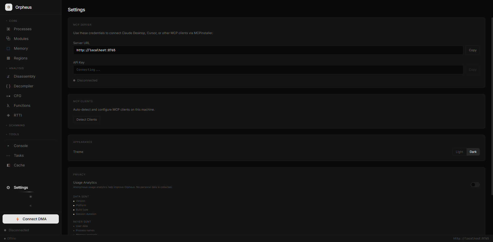

<p align="center">
  
</p>

<p align="center">
  DMA-based memory analysis framework with MCP support for AI-assisted reverse engineering.
</p>

<p align="center">
  <a href="https://github.com/super2xl/orpheus/actions/workflows/release.yml"></a>
  <a href="https://github.com/super2xl/orpheus/releases"></a>
  <a href="https://github.com/super2xl/orpheus/releases"></a>
  <a href="LICENSE"></a>
</p>

---

Orpheus reads process memory through FPGA-based DMA hardware, completely invisible to the target system. It pairs a C++ analysis engine with a modern desktop UI and exposes 70+ tools through the Model Context Protocol, letting AI assistants like Claude perform reverse engineering tasks directly.

## Features

**Core** — Process enumeration, module browsing, hex memory viewer, memory region mapping

**Analysis** — Zydis disassembler, Ghidra decompiler with type injection, control flow graphs, function recovery (prologue + pdata + RTTI), cross-reference finder

**Scanning** — IDA-style pattern matching with wildcards, string scanning (ASCII/UTF-16), memory snapshots with diff comparison, write tracing

**Tools** — Memory writer with type-aware encoding, expression evaluator (`module.dll+0x1234`), pointer chain resolver, vtable reader, Unicorn x64 emulator, module dumper, persistent bookmarks

**AI Integration** — 70+ MCP endpoints, auto-detection and configuration of Claude Desktop / Cursor / Claude Code, transparent opt-out telemetry

## Screenshots

<p align="center">
  
  
</p>
<p align="center">
  <em>Process list &nbsp;•&nbsp; Hex memory viewer</em>
</p>

<p align="center">
  
  
</p>
<p align="center">
  <em>Disassembly &nbsp;•&nbsp; Settings with MCP and privacy controls</em>
</p>

## Requirements

- Windows 10/11 (64-bit)
- DMA hardware (PCILeech-compatible FPGA)
- [Node.js](https://nodejs.org/) 18+ (for MCP bridge)

## Install

Download the latest installer from [Releases](https://github.com/super2xl/orpheus/releases), run it, and launch Orpheus. The application handles DMA initialization — click **Connect DMA** in the sidebar when your hardware is ready.

## MCP Setup

Orpheus acts as an MCP server that AI assistants connect to for memory analysis.

**Automatic** — Go to Settings > MCP Clients > Detect Clients. Orpheus finds and configures Claude Desktop, Cursor, and other supported clients in one click.

**Manual** — Add to your MCP client config:

```json
{
  "mcpServers": {
    "orpheus": {
      "command": "node",
      "args": ["C:/path/to/mcp_bridge.js"],
      "env": {
        "ORPHEUS_MCP_URL": "http://localhost:8765",
        "ORPHEUS_API_KEY": "your_key_here"
      }
    }
  }
}
```

Copy the API key from Settings > MCP Server.

### Available Tools

| Category | Tools |
|----------|-------|
| Memory | `read_memory`, `write_memory`, `scan_pattern`, `scan_strings`, `resolve_pointer` |
| Analysis | `disassemble`, `decompile`, `find_xrefs`, `memory_regions`, `generate_signature` |
| Functions | `recover_functions`, `get_function_at`, `find_function_bounds`, `build_cfg` |
| RTTI | `rtti_parse_vtable`, `rtti_scan`, `rtti_scan_module`, `rtti_cache_*` |
| Snapshots | `memory_snapshot`, `memory_diff`, `memory_snapshot_list` |
| Emulation | `emu_create`, `emu_run`, `emu_set_registers`, `emu_map_module` |
| Utilities | `evaluate_expression`, `bookmark_*`, `task_*`, `telemetry_status` |

## Building from Source

```bash
# Prerequisites: Visual Studio 2022 (C++20), CMake 3.20+, Node.js 18+, Rust stable

# Build C++ core
cmake -B build -DCMAKE_BUILD_TYPE=Release
cmake --build build --config Release --parallel

# Build desktop app
cd ui && npm install && npx tauri build
```

Output: `ui/src-tauri/target/release/bundle/nsis/orpheus_*_x64-setup.exe`

## Project Structure

```
orpheus/
├── src/
│   ├── core/          # DMA interface, runtime management, task system
│   ├── analysis/      # Disassembler, pattern scanner, RTTI, function recovery
│   ├── decompiler/    # Ghidra integration, type injection
│   ├── emulation/     # Unicorn CPU emulator
│   ├── mcp/           # MCP server (70+ handlers)
│   └── utils/         # Cache, bookmarks, telemetry, expression evaluator
├── ui/                # Tauri v2 desktop application
│   ├── src/           # React 19 + TypeScript frontend (24 panels)
│   └── src-tauri/     # Rust shell, DLL loader via FFI
├── cmake/             # Build modules, version generation
├── resources/         # DLLs, fonts, icons, Ghidra SLEIGH specs
└── mcp_bridge.js      # MCP stdio-to-HTTP adapter
```

## Dependencies

**C++ Core** (CMake FetchContent): spdlog, Zydis 4.0, Unicorn 2.1, cpp-httplib, nlohmann/json, Ghidra libdecomp, GoogleTest

**Desktop App**: Tauri v2, React 19, TypeScript, Tailwind CSS v4, Motion

## Telemetry

Anonymous usage analytics help improve Orpheus. Disable anytime in **Settings > Privacy**.

**Sent:** version, platform, build type, session duration
**Never sent:** user data, process names, memory contents, IPs, machine identifiers

Data goes to a Cloudflare Worker. Session IDs are random and unlinkable. [Source code](src/utils/telemetry.cpp) — 90 lines, fully readable.

## License

Copyright (C) 2025 super2xl

This program is free software: you can redistribute it and/or modify it under the terms of the GNU General Public License as published by the Free Software Foundation, either version 3 of the License, or (at your option) any later version.

See [LICENSE](LICENSE) for details.
