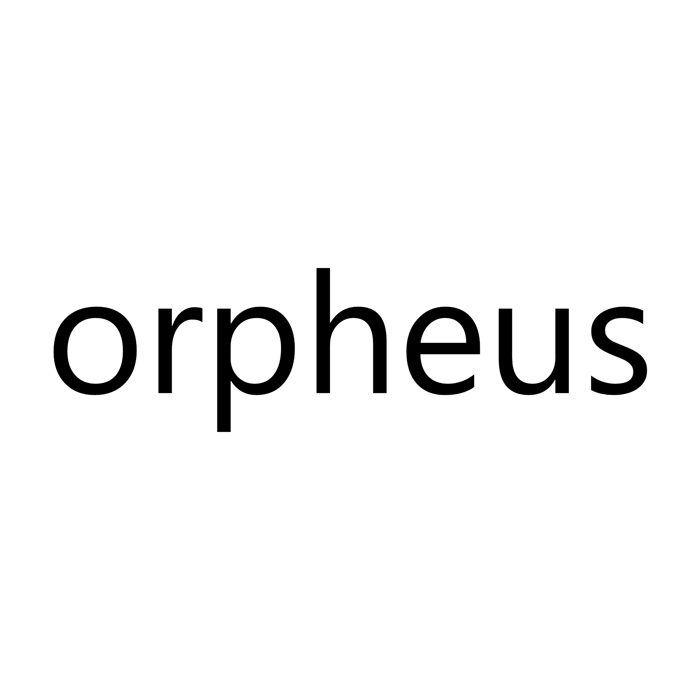
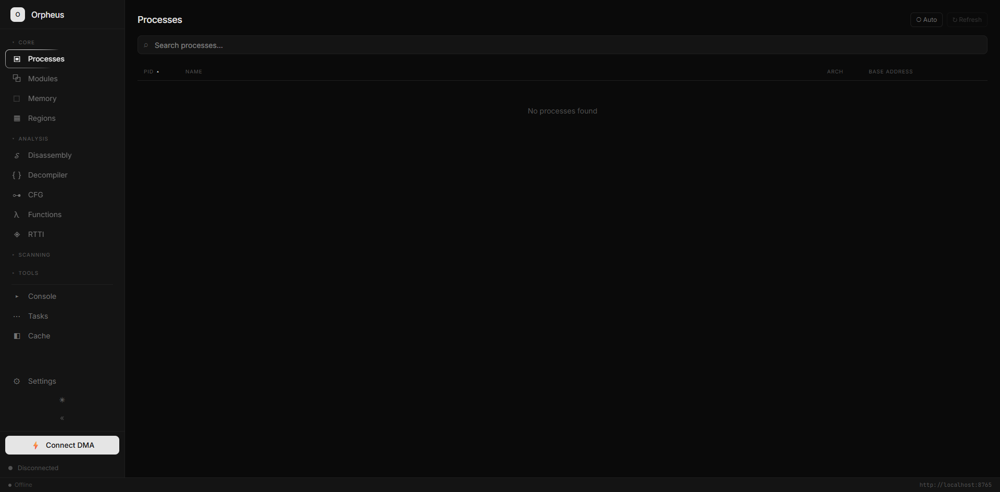
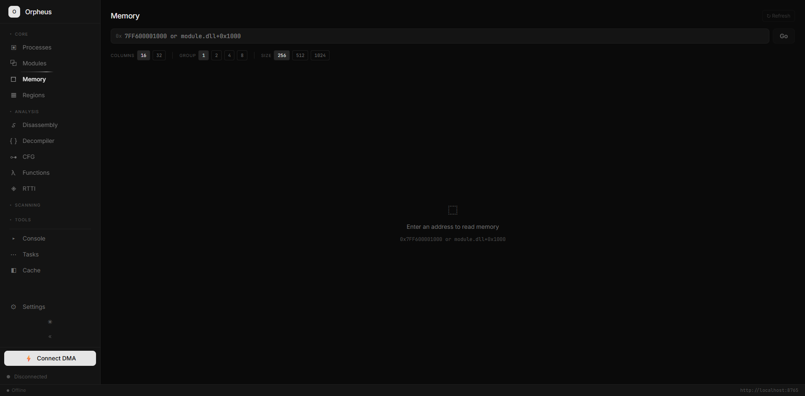
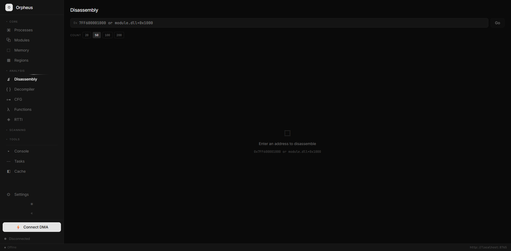

<p align="center">
  
</p>

<p align="center">
  DMA-based memory analysis framework with MCP support for AI-assisted reverse engineering.
</p>

<p align="center">
  <a href="https://github.com/super2xl/orpheus/actions/workflows/release.yml"></a>
  <a href="https://github.com/super2xl/orpheus/releases"></a>
  <a href="https://github.com/super2xl/orpheus/releases"></a>
  <a href="LICENSE"></a>
</p>

## Features

### Core Analysis
- **DMA Memory Access** - Read/write process memory via FPGA DMA hardware
- **Pattern & String Scanning** - Fast signature scanning with wildcard support, async with progress
- **x86-64 Disassembler** - Zydis-powered instruction decoding with control flow analysis
- **Ghidra Decompiler** - Full C pseudocode generation with CS2 schema type injection
- **Function Recovery** - Automatic discovery via prologue, call targets, pdata, and RTTI
- **CFG Analysis** - Control flow graphs with loop detection and visualization layout
- **RTTI Analysis** - Parse MSVC runtime type information, discover class hierarchies
- **CPU Emulation** - Unicorn-based code emulation for decryption stubs

### Tools
- **Memory Writer** - Type-aware value writing with confirmation and history
- **Memory Diff** - Snapshot comparison with highlighted changes
- **Expression Evaluator** - Parse `client.dll+0x1234`, `[[base]+0x10]+0x20`
- **Bookmarks** - Persistent, categorized address annotations
- **Module Dumper** - Dump process modules to disk

### AI Integration
- **MCP Server** - 70+ REST API endpoints for Claude/LLM integration
- **Auto-Configuration** - Detects and configures Claude Desktop, Cursor, and other MCP clients
- **Privacy Controls** - Opt-out telemetry with full transparency in Settings

## Screenshots

<p align="center">
  
  
</p>
<p align="center">
  <em>Process list with live refresh &nbsp;•&nbsp; Module browser with base addresses</em>
</p>

<p align="center">
  
  
</p>
<p align="center">
  <em>Hex editor with ASCII view &nbsp;•&nbsp; x86-64 disassembly</em>
</p>

<p align="center">
  
</p>
<p align="center">
  <em>MCP server configuration with auto-detection</em>
</p>

<p align="center">
  
</p>
<p align="center">
  <em>Status bar with detected FPGA device</em>
</p>

## Requirements

### Windows
- Windows 10/11 (64-bit)
- Visual Studio 2022 with C++20 support
- CMake 3.20+
- DMA hardware (PCILeech-compatible FPGA)

### Linux
- Ubuntu 22.04+ / Debian 12+ (or equivalent)
- GCC 12+ or Clang 15+
- CMake 3.20+
- OpenGL 3.3+ capable GPU
- USB permissions for DMA device (see below)

## Building

### Windows

```bash
# Full build (C++ core + Tauri app)
build.bat

# Or manually:
mkdir build && cd build
cmake ..
cmake --build . --config Release --target orpheus_core
cd ..
copy build\bin\Release\orpheus_core.dll ui\src-tauri\target\release\
cd ui && npm run build && cargo tauri build
```

### Linux

```bash
# Install dependencies (Ubuntu/Debian)
sudo apt install build-essential cmake

# Full build (C++ core + Tauri app)
./build.sh

# Or manually:
mkdir -p build && cd build
cmake ..
cmake --build . -j$(nproc) --target orpheus_core
cd ..
cp build/bin/Release/orpheus_core.dll ui/src-tauri/target/release/
cd ui && npm run build && cargo tauri build

# USB permissions for DMA device
sudo cp resources/99-fpga.rules /etc/udev/rules.d/
sudo udevadm control --reload-rules
sudo udevadm trigger
```

### Output
- `ui/src-tauri/target/release/orpheus` - Main application (Tauri bundle)
- `build/bin/Release/orpheus_core.dll` - C++ analysis engine

## Usage

```bash
# Launch GUI
./orpheus

# Auto-connect to DMA device
./orpheus --connect
```

### MCP Integration

#### Quick Setup (Recommended)

Orpheus auto-detects MCP clients from the Settings panel:

1. Start Orpheus
2. Go to **Settings > MCP Clients**
3. Click **Detect Clients** — finds Claude Desktop, Cursor, Claude Code, etc.
4. Click **Install** next to each client
5. Restart your MCP client to apply

#### Manual Configuration

Alternatively, manually add to your MCP client config (e.g., `~/.claude/claude_desktop_config.json`):

```json
{
  "mcpServers": {
    "orpheus": {
      "command": "node",
      "args": ["C:/path/to/mcp_bridge.js"],
      "env": {
        "ORPHEUS_MCP_URL": "http://192.168.1.100:8765",
        "ORPHEUS_API_KEY": "oph_your_key_here"
      }
    }
  }
}
```

**Notes:**
- `ORPHEUS_MCP_URL`: Use `localhost` if on the same machine, otherwise use the Orpheus server IP
- `ORPHEUS_API_KEY`: Required - copy from Orpheus GUI

### MCP Tools

Orpheus exposes 40+ tools through the MCP API:

| Category | Tools |
|----------|-------|
| Memory | `read_memory`, `write_memory`, `scan_pattern`, `scan_strings`, `resolve_pointer` |
| Analysis | `disassemble`, `decompile`, `find_xrefs`, `memory_regions` |
| Functions | `recover_functions`, `get_function_at`, `get_function_containing`, `build_cfg` |
| RTTI | `rtti_parse_vtable`, `rtti_scan`, `rtti_scan_module`, `rtti_cache_*` |
| Emulation | `emu_create`, `emu_run`, `emu_set_registers`, `emu_map_module` |
| Snapshots | `memory_snapshot`, `memory_diff`, `memory_snapshot_list` |
| Utilities | `evaluate_expression`, `bookmark_*`, `task_*`, `telemetry_status` |

## Project Structure

```
orpheus/
├── src/
│   ├── core/          # DMA interface, runtime management
│   ├── analysis/      # Disassembler, pattern scanner, RTTI, function recovery
│   ├── decompiler/    # Ghidra integration, type injection
│   ├── emulation/     # Unicorn CPU emulator
│   ├── dumper/        # Schema dumper
│   ├── mcp/           # MCP server (70+ handlers)
│   └── utils/         # Cache, bookmarks, expression evaluator
├── ui/                # Tauri desktop application
│   ├── src/           # React 19 + TypeScript frontend
│   ├── src-tauri/     # Tauri v2 Rust shell + DLL loader
│   └── public/        # Static assets
├── cmake/             # CMake modules (dependencies, resource embedding)
├── resources/
│   ├── dlls/          # VMM/LeechCore DLLs
│   └── fonts/         # JetBrains Mono
├── sleigh/            # Ghidra SLEIGH processor specs
└── mcp_bridge.js      # MCP stdio-to-HTTP adapter
```

## Dependencies

### C++ Core (fetched via CMake FetchContent)
- spdlog 1.13.0
- Zydis 4.0.0
- Unicorn Engine 2.1.4
- cpp-httplib 0.15.3
- nlohmann/json 3.11.3
- Ghidra Decompiler (libdecomp)
- GoogleTest 1.14.0 (tests only)

### Tauri Frontend
- React 19 + TypeScript + Tailwind CSS v4
- Tauri v2 (native desktop shell)
- Motion (framer-motion) for animations

## Telemetry

Orpheus collects basic, anonymous usage telemetry to help improve the software. You can disable this in **Settings > Privacy**.

**What's collected:**
- Application version, platform, and build type
- Session start/end times (to calculate usage duration)
- Approximate geographic region (country level, via Cloudflare)

**What's NOT collected:**
- No personal information (usernames, IPs, hardware IDs)
- No process names, memory addresses, or analysis data
- No file paths or system information

Telemetry is sent to a Cloudflare Worker that forwards to Discord for monitoring. Session IDs are random and cannot be linked across sessions.

## License

Copyright (C) 2025 super2xl

This program is free software: you can redistribute it and/or modify it under the terms of the GNU General Public License as published by the Free Software Foundation, either version 3 of the License, or (at your option) any later version.

See [LICENSE](LICENSE) for details.
